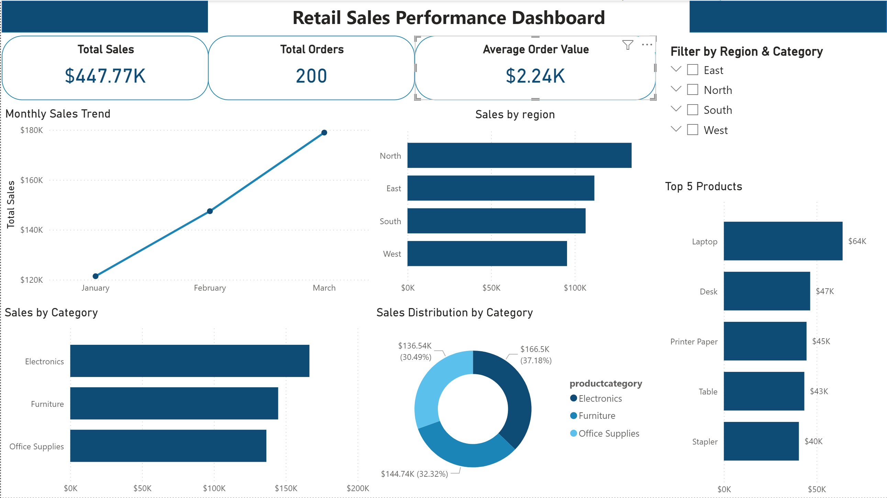

# 🛒 Retail Sales Analysis — PostgreSQL & Power BI


---

## 📌 Project Overview

This end-to-end data analytics project simulates a real-world business intelligence workflow for a retail company. Starting from a raw CSV dataset, the project covers the full pipeline: data ingestion, SQL-based cleaning and transformation, KPI calculation, and the delivery of an interactive Power BI dashboard designed for business decision-makers.

The goal is to surface actionable insights into sales performance — broken down by time, region, and product — enabling stakeholders to monitor trends, identify top-performing categories, and make data-driven decisions.

---

## 🛠️ Tools & Technologies

| Tool | Purpose |
|---|---|
| **PostgreSQL** | Data storage, cleaning, transformation, and KPI queries |
| **Power BI Desktop** | Data modelling, DAX measures, and interactive dashboard |
| **CSV (Retail Dataset)** | Source data |
| **SQL** | Analytical queries and KPI calculation |

---

## 📂 Dataset Description

- **Source:** Retail Sales Dataset (CSV)
- **Contents:** Transactional sales records including order IDs, dates, customer regions, product categories, product names, quantities, and revenue figures
- **Size:** *(add row count and date range once known, e.g., ~50,000 rows spanning Jan 2022 – Dec 2023)*
- **Key Fields:**

| Column | Description |
|---|---|
| `order_id` | Unique identifier per transaction |
| `order_date` | Date the order was placed |
| `region` | Geographic region of the sale |
| `product_category` | High-level product grouping |
| `product_name` | Specific product sold |
| `quantity` | Units sold per order |
| `unit_price` | Price per unit |
| `total_sales` | Revenue generated (quantity × unit_price) |

---

## 🗄️ SQL Analysis

### 1. Data Import & Setup
The CSV dataset was imported into a PostgreSQL database. A structured table was created with appropriate data types, and the raw data was loaded using PostgreSQL's `COPY` command.

### 2. Data Cleaning
Key cleaning steps performed in SQL included:
- Removing duplicate records
- Handling `NULL` values in critical fields
- Standardising date formats and region/category labels
- Validating calculated fields (`total_sales = quantity × unit_price`)

### 3. KPI Queries

**Total Sales**
```sql
SELECT ROUND(SUM(total_sales), 2) AS total_sales
FROM retail_sales;
```

**Total Orders**
```sql
SELECT COUNT(DISTINCT order_id) AS total_orders
FROM retail_sales;
```

**Average Order Value**
```sql
SELECT ROUND(SUM(total_sales) / COUNT(DISTINCT order_id), 2) AS avg_order_value
FROM retail_sales;
```

**Sales by Month**
```sql
SELECT
    TO_CHAR(order_date, 'YYYY-MM') AS month,
    ROUND(SUM(total_sales), 2) AS monthly_sales
FROM retail_sales
GROUP BY month
ORDER BY month;
```

**Sales by Region**
```sql
SELECT
    region,
    ROUND(SUM(total_sales), 2) AS regional_sales
FROM retail_sales
GROUP BY region
ORDER BY regional_sales DESC;
```

**Sales by Product Category**
```sql
SELECT
    product_category,
    ROUND(SUM(total_sales), 2) AS category_sales
FROM retail_sales
GROUP BY product_category
ORDER BY category_sales DESC;
```

**Top 5 Products by Sales**
```sql
SELECT
    product_name,
    ROUND(SUM(total_sales), 2) AS product_sales
FROM retail_sales
GROUP BY product_name
ORDER BY product_sales DESC
LIMIT 5;
```

---

## 📊 Dashboard Features

The Power BI dashboard was connected directly to the PostgreSQL database and presents a clean, interactive single-page layout featuring:

| Visual | Description |
|---|---|
| **KPI Cards** | At-a-glance metrics: Total Sales, Total Orders, Average Order Value |
| **Line Chart** | Monthly Sales Trend to identify seasonality and growth patterns |
| **Bar Chart** | Sales by Region — comparing performance across geographic areas |
| **Bar Chart** | Top 5 Products by Sales — highlighting best-selling items |
| **Donut Chart** | Sales Distribution by Category — showing revenue share per category |
| **Slicers** | Interactive filters by Region and Product Category for drill-down analysis |

All visuals are cross-filtered, allowing users to click any data point and dynamically update the entire dashboard.

---

## 💡 Key Insights

> *(Update these with your actual findings once the dashboard is built)*

- 📈 **Sales Peak in Q4** — Monthly trend reveals a consistent sales spike in October–December, likely driven by seasonal demand.
- 🌍 **Top Performing Region** — [Region Name] accounts for the largest share of total revenue at approximately [X]%.
- 🏆 **Best-Selling Product** — [Product Name] leads all SKUs in revenue, contributing [X]% of total sales.
- 🛍️ **Dominant Category** — [Category Name] represents the highest sales volume, while [Category Name] shows the strongest growth trend.
- 💰 **Average Order Value** — The AOV of $[X] suggests an opportunity to increase basket size through upselling in lower-performing regions.

---

## 🖼️ Dashboard Preview

> *Add a screenshot of your Power BI dashboard below by replacing the placeholder.*



*A clean, interactive Power BI dashboard featuring KPI cards, trend analysis, regional breakdowns, and category distribution visuals.*

---

## ▶️ How to Run the Project

### Prerequisites
- PostgreSQL installed (v13+)
- Power BI Desktop installed (free from Microsoft)
- Dataset CSV file (see `/data` folder)

### Step 1 — Set Up the Database
```sql
-- Create the database
CREATE DATABASE retail_sales_db;

-- Connect to the database and create the table
CREATE TABLE retail_sales (
    order_id      VARCHAR(50),
    order_date    DATE,
    region        VARCHAR(50),
    product_category VARCHAR(100),
    product_name  VARCHAR(150),
    quantity      INT,
    unit_price    NUMERIC(10,2),
    total_sales   NUMERIC(10,2)
);

-- Import the CSV
COPY retail_sales
FROM '/path/to/retail_sales.csv'
DELIMITER ',' CSV HEADER;
```

### Step 2 — Run the SQL Scripts
Execute the scripts in `/sql` in this order:
1. `01_data_cleaning.sql` — Clean and validate the dataset
2. `02_kpi_queries.sql` — Calculate all KPIs

### Step 3 — Connect Power BI to PostgreSQL
1. Open Power BI Desktop
2. Select **Get Data → PostgreSQL Database**
3. Enter your server (`localhost`) and database (`retail_sales_db`)
4. Load the `retail_sales` table into the data model

### Step 4 — Open the Dashboard
- Open `retail_sales_dashboard.pbix` from the `/powerbi` folder
- Refresh the data connection if prompted
- Explore the interactive dashboard

---

## 🗂️ Folder Structure

```
retail-sales-analysis/
│
├── data/
│   └── retail_sales.csv            # Raw source dataset
│
├── sql/
│   ├── 01_data_cleaning.sql        # Data cleaning & validation queries
│   └── 02_kpi_queries.sql          # KPI and analytical queries
│
├── powerbi/
│   └── retail_sales_dashboard.pbix # Power BI dashboard file
│
├── assets/
│   └── dashboard_preview.png       # Dashboard screenshot
│
└── README.md                       # Project documentation
```

---

## ✅ Conclusion

This project demonstrates a complete, production-style data analytics workflow — from raw data ingestion through to a polished, interactive business dashboard. It highlights practical skills in relational database management, SQL query writing, data modelling, and data visualisation.

The combination of PostgreSQL and Power BI reflects a common real-world tech stack used by data analysts in retail, e-commerce, and business intelligence roles. The dashboard is designed to be immediately useful to a non-technical stakeholder, translating raw transactional data into clear, actionable insights.

---

*📫 Feel free to connect with me on [LinkedIn](#) or check out my other projects on [GitHub](#).*
